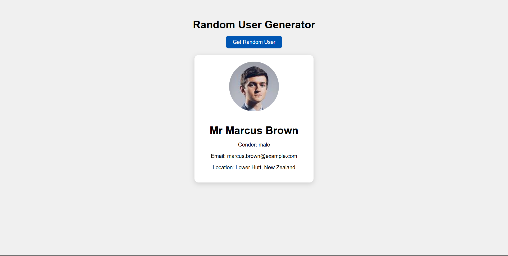

# Random User Generator

A simple **Random User Generator** built using **HTML, CSS, and JavaScript** that fetches user data from the **Random User API** and displays it dynamically on the page.


## 📌 Overview

This project allows users to generate random user profiles with a single click.  
It fetches data asynchronously from an external API and displays user details such as profile image, name, gender, email, and location.


## 🛠️ Tech Stack

- HTML5  
- CSS3  
- JavaScript (Async/Await)  
- Random User API  


## 📂 Folder Structure

random-user-generator-js/
│
├── index.html
├── style.css
└── script.js


## ✨ Features

- Fetches random user data from an external API
- Displays profile image and personal details
- Asynchronous data handling using `fetch` and `async/await`
- Clean and responsive UI
- Error handling for failed API requests


## 🚀 Getting Started

1. Clone the repository  
   ```bash
   git clone https://github.com/dinishsg/random-user-generator-js.git
2. Open index.html in your browser.
3. Click Get Random User to generate a profile.


## 📸 Screenshots




## 🌐 Live Demo

🔗(https://dinishsg.github.io/random-user-generator-js/)
   
   
